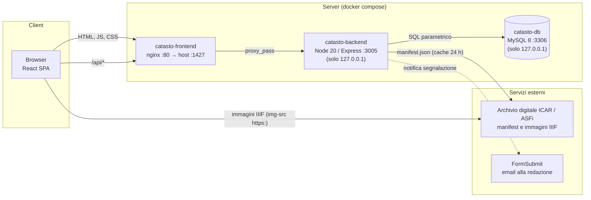
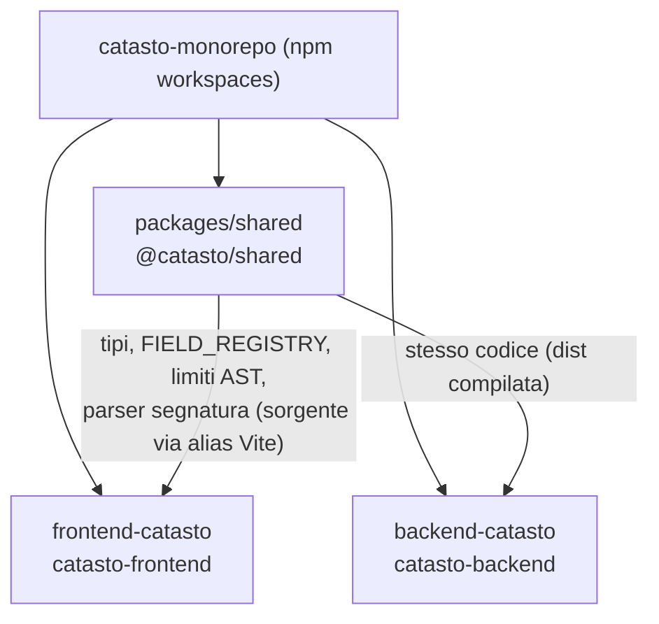
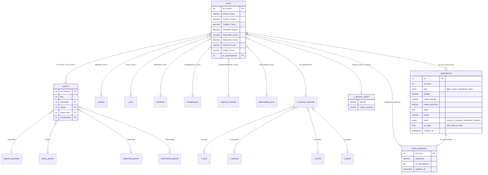
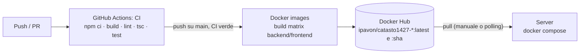

# Architettura e modello dati

Questo documento descrive come sono collegati i componenti del sistema, come sono organizzati i dati e come il progetto viene distribuito.

> Vedi anche: [Backend](backend.md) · [Frontend](frontend.md) · [Casi d'uso](casi-d-uso.md) · [Installazione](guides.md)

---

## Vista d'insieme

- Il browser parla **solo con nginx**: stessa origine per sito e API, quindi CSP `connect-src 'self'` e nessun problema di CORS.
- Il backend scarica dall'Archivio solo il **manifest** del volume; le **immagini** le carica direttamente il browser dal server IIIF.
- Backend e database sono esposti solo su loopback: dall'esterno si raggiunge unicamente la porta 1427 (da mettere dietro un terminatore TLS).

### Monorepo

Il pacchetto condiviso garantisce che frontend e backend usino le stesse regole: se un campo viene aggiunto a `FIELD_REGISTRY`, compare nel QueryBuilder e diventa interrogabile dal backend senza altre modifiche.

---

## Modello dati

I dati storici arrivano dal dump `init/Catasto.sql` (ricerca Klapisch-Zuber / ACRH: circa 61.000 fuochi e 270.000 parenti), che **non è incluso nel repository**. Le tabelle applicative sono create dalle [migrazioni](backend.md#migrazioni).

I tipi delle colonne del dump sono indicativi (dedotti dalle query); fanno fede quelli di `Catasto.sql`.

### Glossario

| Termine | Significato |
|---|---|
| **Fuoco** | Nucleo familiare censito: l'unità del catasto, intestata al capofamiglia |
| **Portata** | Dichiarazione presentata dal contribuente; la sua segnatura non è nei dati ACRH e viene raccolta con le segnalazioni |
| **Campione** | Registro ufficiale redatto dagli ufficiali del catasto: `Volume_Fuoco` / `Foglio_Fuoco` si riferiscono a questo |
| **Carta (c.)** | Foglio del registro, con recto (`r`) e verso (`v`) |
| **Fortune / Credito / Credito ai Monti** | Componenti del patrimonio in fiorini (beni, crediti privati, crediti sul debito pubblico) |
| **Deduzioni** | Detrazioni (bocche a carico, debiti, abitazione) |
| **Imponibile** | Base tassabile risultante |
| **Serie** | Città, contado o distretto |
| **Quartiere / Gonfalone** | Suddivisione urbana di Firenze (Santo Spirito, Santa Croce, Santa Maria Novella, San Giovanni) |
| **Piviere / Popolo** | Circoscrizioni ecclesiastiche usate come unità territoriali |
| **ASFi** | Archivio di Stato di Firenze |

---

## Deploy

| Servizio | Immagine | Porta host | Note |
|---|---|---|---|
| `catasto-db` | `mysql:8.0` | `127.0.0.1:3306` | dati in `./mysql_data` (bind mount), import iniziale da `./init/Catasto.sql` |
| `catasto-backend` | `ipavon/catasto1427-backend` | `127.0.0.1:3005` | parte quando il DB è `healthy` |
| `catasto-frontend` | `ipavon/catasto1427-frontend` | `1427` | nginx: sito statico e proxy `/api` |

### Sicurezza, in sintesi

- **SQL**: tutti i valori sono parametrizzati; colonne, join e ordinamenti arrivano da whitelist.
- **Input**: validazione zod, body JSON max 64 kB, limiti sui valori della ricerca (lunghezza, numero di id, profondità dell'AST).
- **Abuso**: rate limit per IP su tutta l'API, sul manifest e sulle segnalazioni; honeypot nel modulo; IP salvati solo come hash con salt.
- **Moderazione**: token admin confrontato in tempo costante; link email firmati con HMAC, a scadenza, legati a id e azione; il `GET` non modifica nulla.
- **Header**: helmet sul backend, CSP restrittiva e `frame-ancestors 'none'` sul frontend; container con utente non privilegiato.
