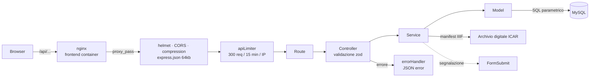
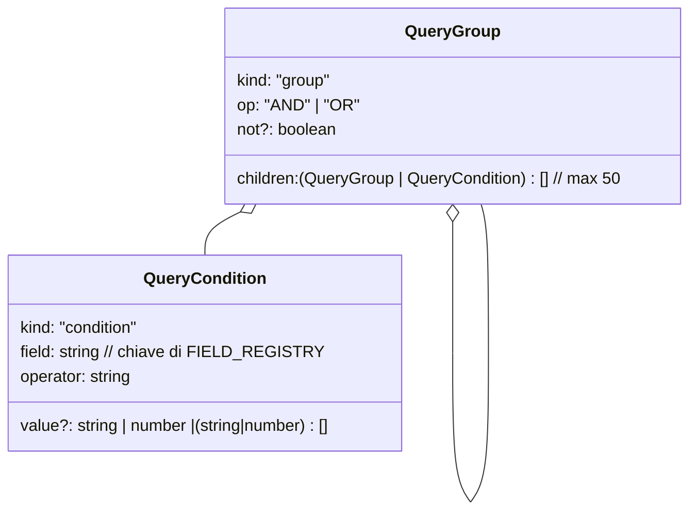
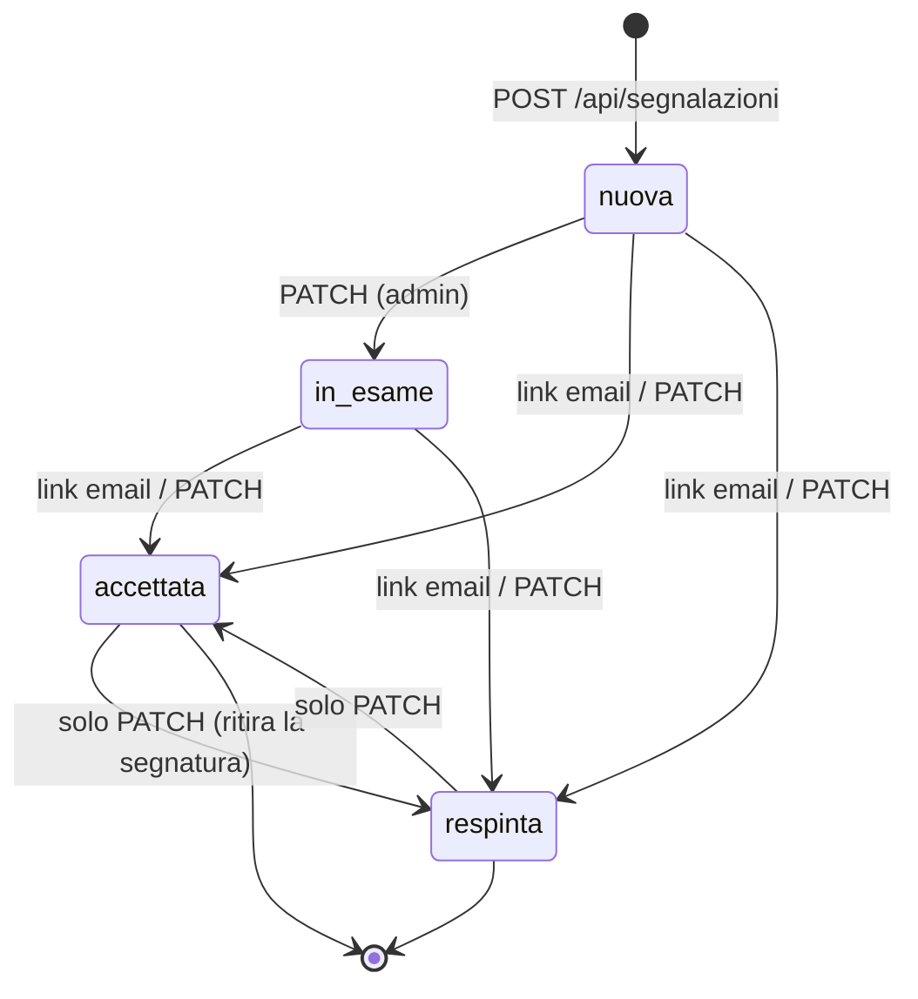
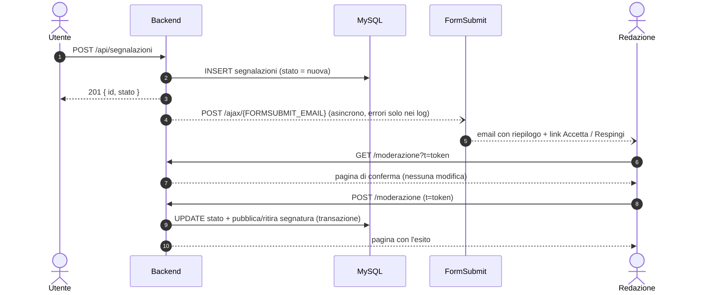

# Backend — Catasto Fiorentino 1427

API REST in **TypeScript** su **Node.js 20 + Express 4**, con **MySQL 8** tramite `mysql2/promise` e validazione con **zod**. Espone i dati del catasto (fuochi, parenti, località, mestieri), la ricerca avanzata a query composte, un proxy per i manifest IIIF dell'Archivio di Stato e il sistema di segnalazioni con moderazione.

> Vedi anche: [Architettura e modello dati](architettura.md) · [Casi d'uso](casi-d-uso.md) · [Installazione](guides.md)

---

## Indice

1. [Struttura del codice](#struttura-del-codice)
2. [Pipeline di una richiesta](#pipeline-di-una-richiesta)
3. [Riferimento API](#riferimento-api)
4. [Ricerca avanzata: formato dell'AST](#ricerca-avanzata-formato-dellast)
5. [Segnalazioni e moderazione](#segnalazioni-e-moderazione)
6. [Traduzioni (`lang=en`)](#traduzioni-langen)
7. [Migrazioni](#migrazioni)
8. [Variabili d'ambiente](#variabili-dambiente)
9. [Script e test](#script-e-test)
10. [Limiti noti](#limiti-noti)

---

## Struttura del codice

Pattern **route → controller → service → model**, con le regole di dominio condivise nel pacchetto `@catasto/shared`.

```
backend-catasto/
├── migrations/
│   ├── 001_segnalazioni.sql      # tabelle applicative (segnalazioni, fuoco_segnature)
│   ├── 002_traduzioni_lookup.sql # traduzioni delle etichette di lookup
│   ├── 003_traduzioni_lookup_seed.sql # traduzioni inglesi iniziali
│   └── 004_traduzioni_lookup_dump.sql # traduzioni delle etichette reali del dump (da db:export-traduzioni)
└── src/
    ├── server.ts                  # bootstrap Express: helmet, CORS, rate limit, rotte, /health
    ├── config/db.ts               # pool mysql2 (connectionLimit 50, TLS opzionale)
    ├── routes/
    │   ├── catasto.routes.ts      # /api/catasto (+ limiter dedicato al manifest)
    │   ├── filter.routes.ts       # /api/filters
    │   ├── parenti.routes.ts      # /api/parenti/:id
    │   ├── mestieri.routes.ts     # /api/mestieri
    │   └── segnalazione.routes.ts # /api/segnalazioni (pubblica, admin, moderazione)
    ├── controllers/
    │   ├── catasto.controller.ts  # fuochi, ricerca avanzata, manifest, parenti, mestieri
    │   ├── filter.controller.ts   # opzioni dei filtri
    │   └── segnalazione.controller.ts
    ├── services/
    │   ├── catasto.service.ts     # orchestrazione query + proxy/caching manifest IIIF
    │   ├── segnalazione.service.ts# creazione, anti-abuso, cambi di stato transazionali
    │   └── notifica.service.ts    # inoltro email via FormSubmit con link firmati
    ├── models/
    │   ├── fuoco.model.ts         # SELECT sui fuochi, join, segnatura della portata
    │   ├── common.model.ts        # lookup, filtri (con cache), parenti, mestieri
    │   ├── traduzioni.model.ts    # lingua (`lang`), traduzioni delle etichette (con cache)
    │   └── segnalazione.model.ts
    ├── middlewares/
    │   ├── admin.middleware.ts    # Bearer ADMIN_TOKEN, confronto timing-safe
    │   ├── async-handler.ts       # inoltra gli errori async all'error handler
    │   └── error.middleware.ts    # 404 + gestione errori (maschera i 5xx in produzione)
    ├── utils/
    │   ├── validation.ts          # paginazione, id numerici, liste di id, HttpError
    │   ├── csv.ts, traduzioni-csv.ts # CSV di export/import delle traduzioni
    │   ├── query-builder.ts       # ricerca semplice (query string) → SQL parametrico
    │   ├── query-ast-builder.ts   # ricerca avanzata (AST) → SQL parametrico
    │   └── moderazione-token.ts   # token HMAC per i link Accetta/Respingi
    ├── views/moderazione.page.ts  # pagine HTML di conferma/esito della moderazione
    └── scripts/
        ├── migrate.ts             # runner delle migrazioni
        ├── export-traduzioni.ts   # CSV dei valori di lookup senza traduzione
        └── import-traduzioni.ts   # import del CSV compilato dalla redazione
```

Il pacchetto **`packages/shared`** contiene ciò che frontend e backend devono vedere allo stesso modo:

| File | Contenuto |
|---|---|
| `fields.ts` | `FIELD_REGISTRY`: campi interrogabili, tipo, colonna SQL, operatori ammessi, join richiesti |
| `query-ast.ts` | Tipi `QueryGroup` / `QueryCondition` e limiti (`AST_MAX_DEPTH`, `AST_MAX_CONDITIONS`, …) |
| `segnalazioni.ts` | Tipi e stati delle segnalazioni |
| `segnatura.ts` | Parser della segnatura della portata (`ASFi, Catasto 81, c. 245r`) |

---

## Pipeline di una richiesta



- **Nessun valore utente finisce nel testo SQL**: colonne, join e ordinamenti arrivano da whitelist (`FIELD_REGISTRY`, `buildOrderBy`); tutti i valori passano come placeholder `?`.
- Gli errori di validazione diventano `400 {"error": "..."}`; in produzione i 5xx rispondono `"Internal Server Error"` senza stack.

---

## Riferimento API

Base URL: stessa origine del sito (`/api`, proxato da nginx) oppure `http://localhost:3005` in sviluppo.

### Riepilogo

| Metodo | Percorso | Accesso | Descrizione |
|---|---|---|---|
| GET | `/health` | pubblico | Stato del servizio e del database |
| GET | `/api/catasto` | pubblico | Ricerca semplice, vista tabella (paginata) |
| GET | `/api/catasto/sidebar` | pubblico | Ricerca semplice, indice leggero per la sidebar |
| POST | `/api/catasto/query` | pubblico | Ricerca avanzata con AST |
| GET | `/api/catasto/manifest/:id` | pubblico, 30 req/15 min | Pagine del volume digitalizzato (IIIF) |
| GET | `/api/filters` | pubblico | Opzioni per i filtri |
| GET | `/api/parenti/:id` | pubblico | Membri del fuoco |
| GET | `/api/mestieri` | pubblico | Elenco grezzo dei mestieri |
| POST | `/api/segnalazioni` | pubblico, 5 req/ora | Invia una segnalazione |
| GET | `/api/segnalazioni` | admin | Elenco segnalazioni |
| PATCH | `/api/segnalazioni/:id` | admin | Cambia lo stato di una segnalazione |
| GET | `/api/segnalazioni/moderazione?t=` | token firmato | Pagina di conferma (non modifica nulla) |
| POST | `/api/segnalazioni/moderazione` | token firmato | Applica la decisione |

Tutti gli endpoint di lettura accettano `?lang=en` (anche `POST /api/catasto/query`, nella query string): vedi [Traduzioni](#traduzioni-langen).

### Limiti di frequenza

| Limiter | Ambito | Soglia |
|---|---|---|
| `apiLimiter` | tutto `/api` | 300 richieste / 15 min / IP |
| manifest | `/api/catasto/manifest/:id` | 30 richieste / 15 min / IP |
| `createLimiter` | `POST /api/segnalazioni` | 5 / ora / IP, più 10 / ora per hash IP salvato nel DB |
| `adminLimiter` | rotte admin e moderazione | 100 richieste **fallite** / 15 min / IP |

I contatori sono in memoria: valgono per processo e si azzerano al riavvio. Dietro un proxy impostare `TRUST_PROXY` (vedi [variabili](#variabili-dambiente)), altrimenti tutte le richieste risultano dallo stesso IP.

### Paginazione e ordinamento

Valida per `/api/catasto`, `/api/catasto/sidebar` e `POST /api/catasto/query`. I valori non validi non danno errore: si usa il default.

| Parametro | Valori | Default |
|---|---|---|
| `page` | intero 1–100000 | `1` |
| `limit` | intero 1–2000 | `50` (`1000` su `GET /sidebar`) |
| `sort_by` | `fortune`, `credito`, `creditoM`, `imponibile`, `deduzioni`, `localita`; qualunque altro valore ordina per nome. A parità di valore decide l'id del fuoco, quindi le pagine non si sovrappongono | nome |
| `order` | `ASC` / `DESC` | `ASC` |

### `GET /api/catasto` — ricerca semplice

Tutti i filtri sono parametri di query **scalari** (`?x[]=` → 400), lunghi al massimo 200 caratteri. Le chiavi sconosciute vengono ignorate.

| Parametro | Semantica |
|---|---|
| `q_persona` | Parole del nome, in qualunque ordine; `di` viene ignorato. `?q_persona=nuto di nardo` → `Nome_Fuoco LIKE %nuto% AND LIKE %nardo%` |
| `q_localita` | Testo cercato in quartiere, popolo, piviere o serie |
| `volume` | Volume esatto (`81`) |
| `mestiere`, `bestiame`, `immigrazione`, `rapporto`, `casa` | Id numerico della voce di lookup |
| `fortune_min` / `fortune_max` (e `credito_*`, `creditoM_*`, `imponibile_*`, `deduzioni_*`) | Intervalli in fiorini (`>=` / `<=`) |
| `serie`, `quartiere`, `piviere`, `popolo` | Lista di id separati da virgola (max 100): `?quartiere=3,7` |
| `particolarita_parente` | Il fuoco ha almeno un parente con quella particolarità |

Esempio:

```http
GET /api/catasto?q_persona=nardo&quartiere=3,7&fortune_min=500&sort_by=fortune&order=DESC&limit=20
```

```json
{
  "data": [
    {
      "id": 1234,
      "nome": "NUTO NARDO",
      "imponibile": 120, "credito": 45, "credito_m": 0, "fortune": 800, "deduzioni": 200,
      "volume": "81", "foglio": "245",
      "particolarita_fuoco": null, "bestiame": "Bue", "immigrazione": null,
      "rapporto_mestiere": "Lavoratore", "mestiere": "Lanaiolo", "casa": "Propria",
      "quartiere": "San Giovanni (I)", "popolo": "San Lorenzo", "piviere": null, "serie": "Città",
      "codice_archivio": "…",
      "segnatura_portata": "ASFi, Catasto 125, c. 306",
      "codice_archivio_portata": "…"
    }
  ],
  "pagination": { "total": 37, "page": 1, "limit": 20, "totalPages": 2 }
}
```

- `codice_archivio` identifica il volume digitalizzato del **campione** (da `t_archivio_volumi`): se presente, il visore può aprire la carta.
- `segnatura_portata` è la segnatura della **portata** pubblicata dalla redazione (da `fuoco_segnature`); `codice_archivio_portata` è il volume corrispondente, se digitalizzato.

### `GET /api/catasto/sidebar`

Stessi filtri. Risposta **senza wrapper**, pensata per un elenco lungo e leggero:

```json
[{ "id": 1234, "nome": "NUTO NARDO", "mestiere": "Lanaiolo" }]
```

### `POST /api/catasto/query` — ricerca avanzata

```json
{
  "ast": { "kind": "group", "op": "AND", "children": [ … ] },
  "view": "table",
  "page": 1, "limit": 50, "sort_by": "fortune", "order": "DESC"
}
```

`view` è `"table"` (risposta come `GET /api/catasto`) o `"sidebar"` (risposta come `GET /sidebar`). Un AST non valido → `400 {"error":"Query non valida: …"}`. Il formato è descritto [più sotto](#ricerca-avanzata-formato-dellast).

### `GET /api/catasto/manifest/:id`

Proxy verso `https://archiviodigitale-icar.cultura.gov.it/metadata/{id}/manifest.json?type=archive`. Restituisce solo ciò che serve al visore:

```json
[
  { "label": "c. 1r", "image": "https://…/full/full/0/default.jpg" },
  { "label": "c. 1v", "image": "https://…/full/full/0/default.jpg" }
]
```

- Solo immagini `https`; `label` troncato a 200 caratteri.
- Cache in memoria di 24 h (max 500 volumi) e `Cache-Control: public, max-age=86400`; le richieste contemporanee per lo stesso volume sono unite in una sola chiamata.
- Errori: `400` id non numerico · `404` volume non trovato · `502` servizio esterno non disponibile o manifest oltre 10 MB (in produzione il 502 arriva come messaggio generico).

### `GET /api/filters`

Opzioni per i menu dei filtri. Parametri opzionali `serie`, `quartiere`, `piviere` (liste di id) restringono i livelli geografici inferiori.

```json
{
  "mestieri":   [{ "id": 12, "label": "Lanaiolo" }],
  "quartieri":  [{ "id": "3,7", "label": "San Giovanni" }],
  "bestiame": [], "rapporto": [], "immigrazione": [], "serie": [],
  "pivieri": [], "popoli": [], "particolaritaParente": [], "casa": []
}
```

Per le partizioni geografiche le voci omonime che differiscono solo per il numero romano (`San Giovanni (I)`, `San Giovanni (II)`) sono **unite**: l'`id` è la lista `"3,7"`, da passare così com'è alla ricerca semplice. Le opzioni statiche restano in cache per tutta la vita del processo.

### `GET /api/parenti/:id`

```json
[
  { "eta": 40, "parentela_desc": "Capofamiglia", "sesso": "M", "stato_civile": "Coniugato", "particolarita": null },
  { "eta": 32, "parentela_desc": "Moglie",       "sesso": "F", "stato_civile": "Coniugata", "particolarita": null }
]
```

Un fuoco inesistente restituisce `[]`.

### `GET /api/mestieri`

Righe grezze della tabella `mestieri`, ordinate per nome. Il frontend usa invece `/api/filters`.

### `GET /health`

`200 {"status":"ok","db":"up"}` oppure `503 {"status":"error","db":"down"}`. Non soggetto al rate limit: usarlo per healthcheck e monitoraggio.

---

## Ricerca avanzata: formato dell'AST



**Limiti** (superati → 400, mai troncamento): profondità 5, 50 condizioni totali, 100 valori per `in`/`not_in`, 200 caratteri per valore testuale.

### Campi

| Chiave | Etichetta | Tipo | Note |
|---|---|---|---|
| `nome` | Nome fuoco | text | |
| `volume` | Volume | text | |
| `foglio` | Foglio (carta) | text | |
| `fortune`, `credito`, `credito_m`, `imponibile`, `deduzioni` | Dati economici | number | fiorini |
| `mestiere`, `bestiame`, `immigrazione`, `rapporto`, `casa` | Attributi | enum | id di lookup |
| `serie`, `quartiere`, `piviere`, `popolo` | Geografia | enum | join su `t_struttura_catastale` |
| `particolarita_parente` | Particolarità parente | enum | `EXISTS` sui parenti |
| `eta_parente` | Età parente | number | `EXISTS`: "almeno un parente con…" |
| `segnatura_portata` | Segnatura della portata | text | dato redazionale |

### Operatori

| Tipo | Operatori |
|---|---|
| text | `contains`, `not_contains`, `starts_with`, `eq`, `neq`, `is_empty`, `is_not_empty` |
| number | `eq`, `neq`, `gt`, `gte`, `lt`, `lte`, `between` (`[min, max]`), `is_empty`, `is_not_empty` |
| enum | `eq`, `neq`, `in`, `not_in`, `is_empty`, `is_not_empty` |

Regole di traduzione:

- `neq`, `not_contains`, `not_in` includono anche i valori `NULL` (“diverso da X” comprende “non indicato”).
- Sui campi dei parenti le forme negative diventano `NOT EXISTS`: `eta_parente neq 0` = "nessun parente di età 0".
- `not: true` su un gruppo produce `NOT ( … )`; un gruppo vuoto vale `1=1`.
- Per `serie`, `quartiere`, `piviere` e `popolo` il valore può essere la lista di id restituita da `/api/filters` (`"3,7"`): `eq` diventa `IN (3, 7)`, `neq` `NOT IN`, e le liste dentro `in` / `not_in` vengono espanse.
- Un AST oltre i 5 livelli viene rifiutato con `400` prima della validazione completa, anche se annidato migliaia di volte.

### Esempio

"Fuochi con nome che contiene *Nardo*, con fortune fra 100 e 500 **oppure** mestiere 12/15, e almeno un parente oltre i 60 anni":

```json
{
  "ast": {
    "kind": "group", "op": "AND", "children": [
      { "kind": "condition", "field": "nome", "operator": "contains", "value": "nardo" },
      { "kind": "group", "op": "OR", "children": [
        { "kind": "condition", "field": "fortune",  "operator": "between", "value": [100, 500] },
        { "kind": "condition", "field": "mestiere", "operator": "in",      "value": [12, 15] }
      ]},
      { "kind": "condition", "field": "eta_parente", "operator": "gt", "value": 60 }
    ]
  },
  "view": "table", "page": 1, "limit": 50, "sort_by": "fortune", "order": "DESC"
}
```

SQL generato (semplificato):

```sql
WHERE ( f.Nome_Fuoco LIKE ? ESCAPE '!'
        AND ( f.Fortune_Fuoco BETWEEN ? AND ? OR f.Mestiere_Fuoco IN (?, ?) )
        AND EXISTS (SELECT 1 FROM parenti p_sub
                    WHERE p_sub.ID_FUOCO = f.ID_Fuochi AND p_sub.Eta > ?) )
-- parametri: ['%nardo%', 100, 500, 12, 15, 60]
```

---

## Segnalazioni e moderazione

### `POST /api/segnalazioni`

| Campo | Regole |
|---|---|
| `id_fuoco` | intero > 0 o `null` (obbligatorio per `segnatura`); se presente deve esistere |
| `tipo` | `dato_errato` · `segnatura` · `altro` |
| `campo` | chiave di un campo segnalabile (obbligatorio per `dato_errato`) |
| `valore_attuale`, `valore_proposto` | max 500 caratteri (`valore_proposto` obbligatorio per `segnatura`) |
| `note` | max 2000 caratteri (per `altro` serve `valore_proposto` o `note`) |
| `email` | email valida o `null` (non stringa vuota) |
| `website` | honeypot: se compilato la richiesta viene scartata in silenzio |

Risposta: `201 {"id": 57, "stato": "nuova"}`. L'IP non viene salvato in chiaro ma come hash con `SEGNALAZIONI_SALT`.

### Ciclo di vita



- I **link email** agiscono solo su segnalazioni `nuova` o `in_esame`; altrimenti rispondono `409`.
- La **PATCH admin** accetta qualunque transizione.
- Effetti per `tipo = segnatura`: diventando `accettata` la segnatura è pubblicata in `fuoco_segnature`. Lasciando `accettata`, se era quella pubblicata, torna visibile l'ultima altra segnatura ancora accettata per lo stesso fuoco; se non ce ne sono, il fuoco resta senza. Tutto in transazione con `SELECT … FOR UPDATE`.
- Per `dato_errato` e `altro` cambia solo lo stato: la correzione del dato resta manuale.

### Flusso email (FormSubmit)



Il **token** è `id.azione.scadenza.HMAC-SHA256(MODERAZIONE_SECRET)` in base64url, valido 14 giorni: firma id, azione e scadenza, quindi non si può riusare per un'altra segnalazione o per la decisione opposta. Il `GET` non modifica nulla perché i filtri antispam aprono da soli i link delle email.

Esiti della moderazione: `403` secret non configurato · `400` token non valido · `410` scaduto · `404` segnalazione inesistente · `409` già decisa.

**Configurazione.** Al primo invio FormSubmit manda un'email di attivazione all'indirizzo: va confermata una volta, poi si può usare l'alias casuale fornito. Diagnosi dai log del backend:

| Log | Significato |
|---|---|
| `⚠️ FORMSUBMIT_EMAIL non impostata` (all'avvio) | la variabile non arriva al container |
| `⚠️ FormSubmit: invio ... non riuscito` | FormSubmit ha rifiutato (es. form da attivare) |
| `📧 FormSubmit: segnalazione #N inoltrata` | accettata da FormSubmit: controllare lo spam |

> **Nota di sicurezza.** I link di moderazione transitano per FormSubmit e per la casella della redazione: chi vi ha accesso può decidere le segnalazioni aperte finché il token non scade. Proteggere la casella come si proteggerebbe `ADMIN_TOKEN`.

### API admin

Header `Authorization: Bearer <ADMIN_TOKEN>` (prefisso `Bearer ` sensibile alle maiuscole). Senza `ADMIN_TOKEN` configurato le rotte rispondono `403`; token errato → `401`.

```bash
# Elenco delle segnalazioni nuove
curl -H "Authorization: Bearer $ADMIN_TOKEN" \
  "https://catasto.example.org/api/segnalazioni?stato=nuova&limit=20"

# Accetta la segnalazione 57
curl -X PATCH -H "Authorization: Bearer $ADMIN_TOKEN" -H "Content-Type: application/json" \
  -d '{"stato":"accettata"}' https://catasto.example.org/api/segnalazioni/57
```

---

## Traduzioni (`lang=en`)

Il sito ha una versione inglese: il frontend aggiunge `?lang=en` a ogni richiesta quando l'inglese è attivo (in italiano non manda nulla). È riconosciuto solo `en`; qualunque altro valore, o nessuno, vale italiano e non produce mai un errore.

**Cosa si traduce.** Solo le etichette delle tabelle di lookup del dump; id, filtri e semantica delle ricerche restano identici. Luoghi (serie, quartieri, pivieri, popoli) e nomi di persona sono nomi propri e restano in italiano, come i messaggi di errore.

| Endpoint | Campi tradotti |
|---|---|
| `GET /api/filters` | `bestiame`, `rapporto`, `immigrazione`, `mestieri`, `particolaritaParente`, `casa` (`mestieri`, `casa` e `particolaritaParente` riordinati per etichetta tradotta) |
| `GET /api/catasto`, `POST /api/catasto/query` | `mestiere`, `bestiame`, `immigrazione`, `rapporto_mestiere`, `casa`, `particolarita_fuoco` |
| `GET /api/catasto/sidebar` | `mestiere` |
| `GET /api/parenti/:id` | `parentela_desc`, `sesso`, `stato_civile`, `particolarita` |
| `GET /api/mestieri` | `Mestiere` (riordinato) |

Un valore senza traduzione resta in italiano. L'ordinamento SQL della tabella (`sort_by=mestiere`) resta quello dell'etichetta italiana.

**Tabella `traduzioni_lookup`** (migrazione `002`): `tabella` (nome della tabella del dump: `mestieri`, `bestiame`, `rapporto_mestiere`, `immigrazione`, `casa`, `particolarita_fuoco`, `particolarita_parenti`, `rapporti_parentela`, `sesso_parenti`, `statocivile_parenti`), `valore_it`, `lingua` (`en`), `valore`. La chiave è l'**etichetta italiana**, non l'id: la tabella sta fuori dal dump, sopravvive ai reimport e si popola senza conoscere gli id. Il confronto ignora maiuscole, accenti e spazi superflui (collation `utf8mb4_unicode_ci` nel DB, stessa normalizzazione nel backend).

**Seed** (migrazione `003`): circa 590 traduzioni di valori plausibili — sesso, stato civile, parentela, casa, rapporto di lavoro, bestiame, immigrazione, particolarità e circa 250 grafie di mestieri del vocabolario del Catasto del 1427 (Herlihy e Klapisch-Zuber). Le righe che non corrispondono a valori del dump sono innocue; `INSERT IGNORE` non sovrascrive traduzioni già corrette.

**Etichette reali** (migrazione `004`): il dump usa descrizioni lunghe ("arte della lana, lanaiolo, ritagliatore, …"), che il seed di `003` non intercettava. `004` traduce le 226 etichette esportate dal database di produzione con `db:export-traduzioni` (tutte le tabelle di lookup) e, a differenza di `003`, aggiorna le righe già presenti. Funziona uguale su MySQL e TiDB.

**Cache.** Le traduzioni restano in memoria 10 minuti per lingua (la copia italiana dei filtri in cache non viene mai modificata: la traduzione ne fa una copia). Se la tabella non esiste (migrazione non applicata) o il DB dà errore, le risposte restano in italiano invece di andare in 500.

**Completare le traduzioni.** La redazione lavora su un CSV `tabella,valore_it,valore_en`:

```bash
# valori distinti del dump ancora senza traduzione (--tutte: anche quelli tradotti)
npm run db:export-traduzioni -w catasto-backend -- mancanti.csv
# compilata la colonna valore_en, import (righe vuote ignorate, esistenti aggiornate)
npm run db:import-traduzioni -w catasto-backend -- mancanti.csv

# dalla build (container)
node backend-catasto/dist/scripts/export-traduzioni.js > mancanti.csv
node backend-catasto/dist/scripts/import-traduzioni.js mancanti.csv
```

Il CSV segue RFC 4180 (campi con virgole o apici fra doppi apici). L'import è transazionale e il backend vede le nuove traduzioni entro 10 minuti.

---

## Migrazioni

Il dump dell'Archivio (`init/Catasto.sql`) contiene i dati storici. Le tabelle applicative (`segnalazioni`, `fuoco_segnature`, `traduzioni_lookup`, `schema_migrations`) sono create dal runner in `src/scripts/migrate.ts`, che applica in ordine i file `migrations/*.sql` non ancora registrati.

La ricerca in tabella legge `fuoco_segnature`: senza migrazioni risponde 500.

- **Docker**: il container del backend applica le migrazioni mancanti a ogni avvio, prima di far partire il server. Se una migrazione fallisce il container si ferma (e il compose lo riavvia): l'errore è in `docker compose logs backend`.
- **Sviluppo**: vanno eseguite a mano.

```bash
# sviluppo (legge backend-catasto/.env)
npm run db:migrate -w catasto-backend

# container, a mano (di norma non serve)
docker compose exec backend node backend-catasto/dist/scripts/migrate.js
```

---

## Variabili d'ambiente

| Variabile | Default | Uso |
|---|---|---|
| `PORT` | `3005` | Porta HTTP |
| `NODE_ENV` | — (`production` nell'immagine Docker) | In produzione maschera i 5xx e rende obbligatorio `SEGNALAZIONI_SALT` |
| `DB_HOST`, `DB_USER`, `DB_PASSWORD`, `DB_NAME` | — | Connessione MySQL |
| `DB_PORT` | `3306` | |
| `DB_SSL` | `false` | `true` attiva TLS ≥ 1.2 con verifica del certificato |
| `CORS_ORIGIN` | vuota = tutte le origini | Origini ammesse, separate da virgola |
| `TRUST_PROXY` | non impostata | Numero di proxy davanti al backend (`1` con nginx). Accetta anche `true`/`false` o nomi come `loopback`, ma `true` fa fidare di qualunque `X-Forwarded-For`: usare un numero |
| `SEGNALAZIONI_SALT` | obbligatoria in produzione | Salt dell'hash degli IP |
| `ADMIN_TOKEN` | vuota = area admin chiusa | Token Bearer della moderazione via API |
| `FORMSUBMIT_EMAIL` | vuota = nessuna email | Destinatario delle segnalazioni |
| `FORMSUBMIT_ORIGIN` | primo `CORS_ORIGIN` | Origin inviata a FormSubmit e base dei link |
| `MODERAZIONE_SECRET` | vuota = niente link | Chiave HMAC dei link Accetta/Respingi |
| `PUBLIC_API_URL` | origin del sito | Base di `/api` nei link, se diversa dal sito |

Esempio completo per la produzione: [`.env.prod.example`](../.env.prod.example).

---

## Script e test

| Comando (in `backend-catasto/`) | Effetto |
|---|---|
| `npm run dev` | `tsx watch src/server.ts` |
| `npm run build` | `tsup` → `dist/server.js` e `dist/scripts/*.js` (migrazioni, export/import traduzioni) |
| `npm start` | avvia `dist/server.js` |
| `npm run db:migrate` | migrazioni da sorgente (`tsx`) |
| `npm run db:migrate:prod` | migrazioni dalla build |
| `npm run db:export-traduzioni [-- file.csv]` | CSV dei valori di lookup senza traduzione inglese |
| `npm run db:import-traduzioni -- file.csv` | importa il CSV compilato in `traduzioni_lookup` |
| `npm test` | `vitest run` |

I test (vitest, database sempre simulato) coprono query builder semplice e AST (compresi liste geografiche, ordinamento stabile e AST troppo annidati), token di moderazione, servizio di notifica, cambi di stato delle segnalazioni (con il ripristino della segnatura precedente), validazione della creazione, rotte di moderazione, `TRUST_PROXY`, `toPages` del manifest, l'associazione portata→volume e le traduzioni (parsing di `lang`, normalizzazione, fallback, cache, CSV di export/import). Non ci sono ancora test per i controller di ricerca, i middleware o test di integrazione su MySQL.

---

## Limiti noti

I problemi emersi dalla revisione del codice di settembre 2026 sono stati corretti; lo storico è in [revisione-codice.md](revisione-codice.md). Restano due comportamenti da conoscere:

| Area | Descrizione |
|---|---|
| Cache | Le opzioni dei filtri non scadono: dopo un reimport del dump serve riavviare il backend. |
| Rate limit | I contatori sono in memoria e per processo: con più istanze del backend i limiti valgono per istanza. |
