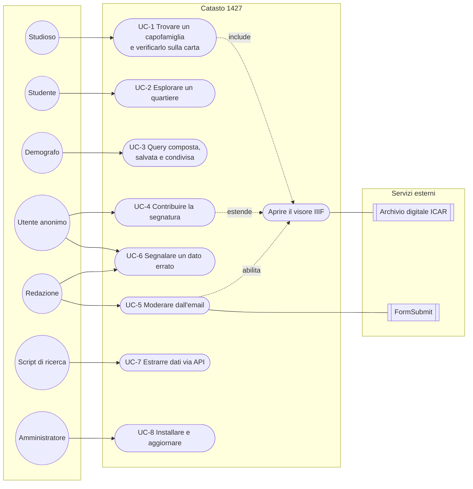
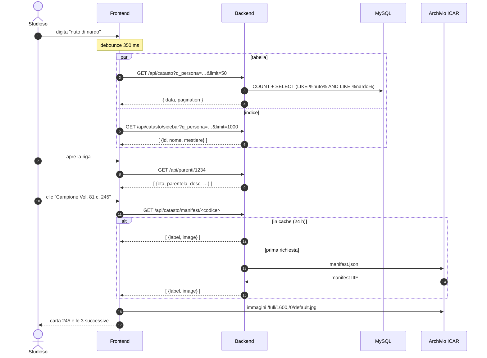
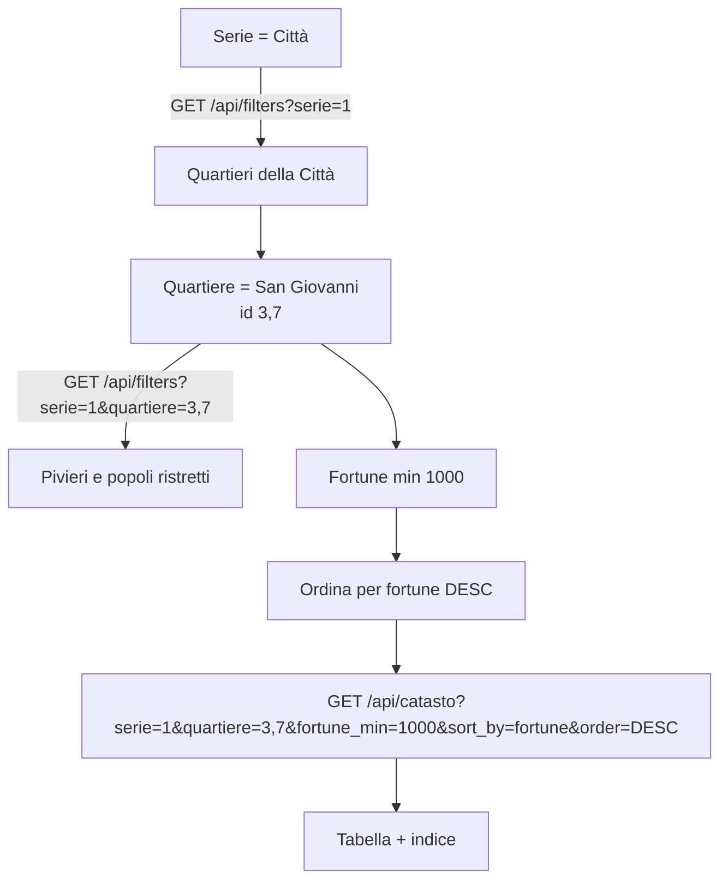
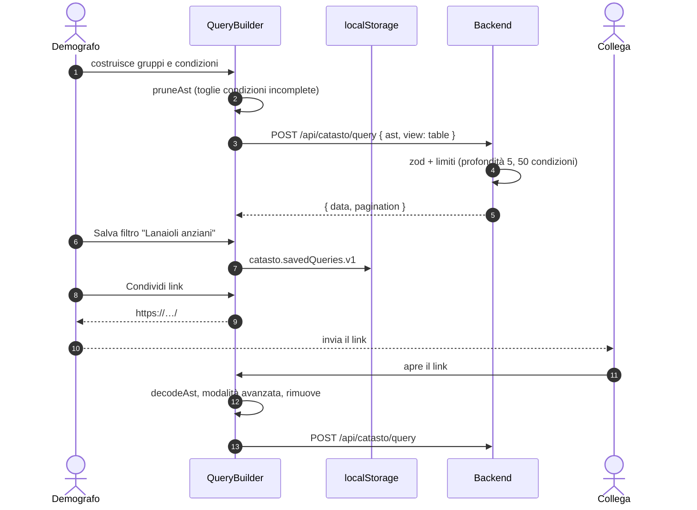
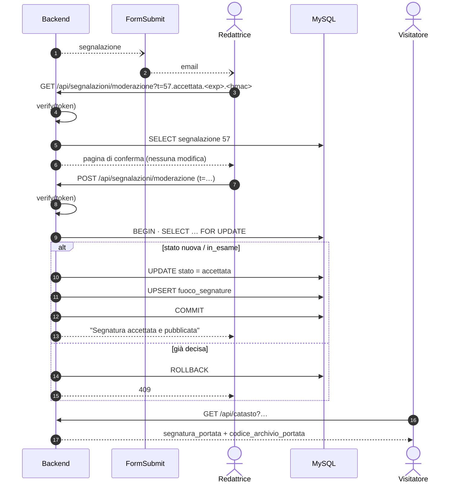
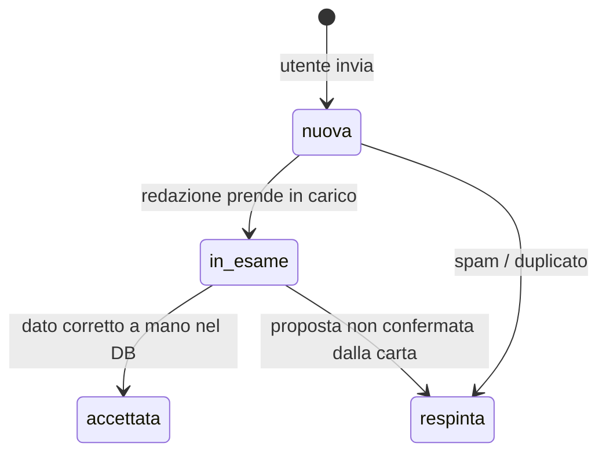
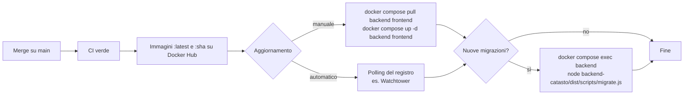

# Casi d'uso

Scenari reali di utilizzo del portale, dal punto di vista di chi lo usa e di cosa succede nel sistema. Ogni caso indica attori, precondizioni, flusso principale, varianti e le chiamate API coinvolte.

> Nomi, id e valori negli esempi sono **illustrativi**: servono a mostrare il formato, non riportano dati del catasto.

---

## Indice

| # | Caso d'uso | Attore principale |
|---|---|---|
| [UC-1](#uc-1--trovare-un-capofamiglia-e-verificarlo-sulla-carta) | Trovare un capofamiglia e verificarlo sulla carta | Studioso |
| [UC-2](#uc-2--esplorare-un-quartiere-per-ricchezza) | Esplorare un quartiere per ricchezza | Studente |
| [UC-3](#uc-3--costruire-salvare-e-condividere-una-query-composta) | Costruire, salvare e condividere una query composta | Demografo |
| [UC-4](#uc-4--contribuire-la-segnatura-della-portata) | Contribuire la segnatura della portata | Utente anonimo |
| [UC-5](#uc-5--moderare-una-segnalazione-dallemail) | Moderare una segnalazione dall'email | Redazione |
| [UC-6](#uc-6--segnalare-e-correggere-un-dato-errato) | Segnalare e correggere un dato errato | Utente + Redazione |
| [UC-7](#uc-7--estrarre-dati-via-api-per-unanalisi) | Estrarre dati via API per un'analisi | Ricercatore (script) |
| [UC-8](#uc-8--installare-e-aggiornare-il-portale) | Installare e aggiornare il portale | Amministratore di sistema |

### Diagramma dei casi d'uso



---

## UC-1 — Trovare un capofamiglia e verificarlo sulla carta

**Attore**: studioso · **Obiettivo**: trovare il fuoco di una persona nota da un'altra fonte e controllare la trascrizione sulla carta originale.

**Precondizioni**: il volume del campione è digitalizzato (compare `codice_archivio`).

**Flusso principale**

1. Nella casella **Cerca Persona** scrive `nuto di nardo`.
2. Dopo 350 ms il frontend chiama `GET /api/catasto?q_persona=nuto di nardo&sort_by=nome&order=ASC&page=1&limit=50`; il backend scarta "di" (nel database nome e patronimico sono un unico campo, "NUTO NARDO") e cerca i fuochi il cui nome contiene sia *nuto* sia *nardo*, in qualunque ordine.
3. La tabella mostra i risultati; l'indice laterale mostra lo stesso elenco.
4. Lo studioso apre la riga: vede i dati economici e, caricata con `GET /api/parenti/:id`, la composizione familiare.
5. Clicca **Campione — Vol. 81 c. 245**: il visore chiama `GET /api/catasto/manifest/:id`, individua la carta 245 e mostra le 4 carte che partono da lì.
6. Confronta la carta con i dati trascritti, ingrandendo con la rotella o col pinch.

**Varianti**

- *5a. Volume digitalizzato in due parti* (es. vol. 125): il visore sceglie la parte in base alla carta.
- *5b. Carta non individuata*: il visore apre la prima carta del volume e lo segnala; resta il link **Sito originale**.
- *5c. Archivio non raggiungibile*: il backend risponde 502, il visore mostra un messaggio d'errore.
- *6a. La trascrizione non corrisponde*: prosegue con [UC-6](#uc-6--segnalare-e-correggere-un-dato-errato).



---

## UC-2 — Esplorare un quartiere per ricchezza

**Attore**: studente · **Obiettivo**: vedere chi erano i fuochi più ricchi di un quartiere e di che mestiere.

**Flusso principale**

1. Apre **Altri filtri** e sceglie **Serie = Città**, poi **Quartiere = San Giovanni** (le opzioni dei livelli inferiori si restringono con `GET /api/filters?serie=…`).
2. Imposta **Fortune min = 1000**.
3. Clicca l'intestazione **Dati sintetici** due volte per ordinare per fortune decrescenti.
4. Il frontend chiama `GET /api/catasto?serie=1&quartiere=3,7&fortune_min=1000&sort_by=fortune&order=DESC&page=1&limit=50`.
5. Scorre le pagine con la paginazione o salta a una pagina precisa.
6. Per capire i termini (fortune, imponibile, piviere) consulta la pagina **Informazioni** o il [glossario](architettura.md#glossario).

**Varianti**

- *1a. Nessun risultato*: la tabella propone **Azzera i filtri**.
- *4a. Il quartiere unisce più partizioni* (`San Giovanni (I)` e `(II)`): l'id `"3,7"` viene espanso in `IN (3, 7)`.



---

## UC-3 — Costruire, salvare e condividere una query composta

**Attore**: demografo · **Obiettivo**: individuare i fuochi di artigiani della lana che hanno almeno un parente oltre i 60 anni, escludendo i nuclei immigrati, e condividere la ricerca con un collega.

**Flusso principale**

1. Attiva **Ricerca avanzata** (i filtri semplici vengono sospesi).
2. Gruppo radice **Tutte**:
   - `Mestiere` **è uno fra** *Lanaiolo*, *Tessitore*;
   - `Età parente` **maggiore di** 60;
   - `Immigrazione` **è vuoto**.
3. Aggiunge un **gruppo** *Almeno una* con `Fortune` **tra** 100 e 2000 oppure `Casa` **è uguale a** *Propria*.
4. Controlla l'anteprima: *Mostra i fuochi dove Mestiere è uno fra "Lanaiolo", "Tessitore" e Età parente maggiore di 60 e Immigrazione è vuoto e (Fortune tra 100 e 2000 oppure Casa è uguale a "Propria")*.
5. Il frontend invia `POST /api/catasto/query` (vedi corpo sotto).
6. Scrive il nome *Lanaioli anziani* e clicca **Salva filtro**: la query resta in `localStorage` su questo dispositivo.
7. Clicca **Condividi link** e incolla l'URL (`…/#q=eyJraW5kIjoi…`) in un'email.
8. Il collega apre il link: il portale entra in ricerca avanzata con la stessa query e rimuove il frammento dall'indirizzo.

```json
{
  "ast": {
    "kind": "group", "op": "AND", "children": [
      { "kind": "condition", "field": "mestiere",     "operator": "in",       "value": ["12", "57"] },
      { "kind": "condition", "field": "eta_parente",  "operator": "gt",       "value": 60 },
      { "kind": "condition", "field": "immigrazione", "operator": "is_empty" },
      { "kind": "group", "op": "OR", "children": [
        { "kind": "condition", "field": "fortune", "operator": "between", "value": [100, 2000] },
        { "kind": "condition", "field": "casa",    "operator": "eq",      "value": "1" }
      ]}
    ]
  },
  "view": "table", "page": 1, "limit": 50, "sort_by": "nome", "order": "ASC"
}
```

Gli id delle voci (mestiere, casa…) sono quelli restituiti da `GET /api/filters`; l'interfaccia li invia come stringhe, l'API accetta anche numeri.

**Varianti**

- *2a. Condizione incompleta* (valore non ancora scelto): viene esclusa automaticamente dalla query finché non è completa.
- *3a. Oltre 5 livelli di annidamento*: il pulsante **+ Gruppo** si disattiva. Una query con più di 50 condizioni viene rifiutata dal backend con `400`.
- *7a. Link oltre 2000 caratteri*: il portale avvisa che la query è troppo lunga da condividere; resta possibile salvarla.
- *Limite noto*: condizioni su Serie/Quartiere/Piviere/Popolo con partizioni omonime restituiscono solo la prima (vedi [revisione](revisione-codice.md)). Per ora conviene filtrare la geografia con la ricerca semplice.



---

## UC-4 — Contribuire la segnatura della portata

**Attore**: utente anonimo (spesso uno studioso che ha consultato la portata in archivio) · **Obiettivo**: far sapere dove si trova la portata di un fuoco.

**Precondizioni**: la scheda del fuoco non ha ancora una portata pubblicata.

**Flusso principale**

1. Nella riga aperta clicca **Segnatura della portata non nota — contribuisci** (oppure **Segnala segnatura** nel visore).
2. Il modulo si apre sul tipo **Segnatura della portata**, con il prefisso `ASFi, Catasto` già indicato.
3. Scrive `81, c. 245r`, facoltativamente una nota e la propria email.
4. Invia: `POST /api/segnalazioni` con `{"id_fuoco":1234,"tipo":"segnatura","valore_proposto":"ASFi, Catasto 81, c. 245r",…}`.
5. Il backend verifica che il fuoco esista, salva la segnalazione come `nuova` (IP solo come hash) e risponde `201`.
6. L'utente vede la conferma: la segnatura sarà pubblicata dopo la verifica della redazione.
7. In background parte la notifica alla redazione ([UC-5](#uc-5--moderare-una-segnalazione-dallemail)).

**Varianti**

- *3a. Fondo diverso dal Catasto*: spunta "altro fondo" e scrive la segnatura completa.
- *4a. Più di 5 invii in un'ora dallo stesso IP*: `429 Troppe segnalazioni inviate`.
- *4b. Bot che compila il campo nascosto*: risposta `201` con `id: null`, nulla viene salvato.

---

## UC-5 — Moderare una segnalazione dall'email

**Attore**: redazione · **Obiettivo**: accettare o respingere una segnalazione senza accedere a un pannello.

**Precondizioni**: `FORMSUBMIT_EMAIL` e `MODERAZIONE_SECRET` configurati; form FormSubmit attivato.

**Flusso principale**

1. Arriva l'email "Segnalazione #57" con tipo, fuoco (nome, volume, carta, località), valore proposto, note, email del segnalatore (impostata come *reply-to*) e due link: **Accetta** e **Respingi**.
2. La redattrice clicca **Accetta**: si apre una pagina di conferma con i dati della proposta. **Nulla è ancora cambiato.**
3. Verifica la segnatura (ad esempio sulla carta nel visore) e preme **Accetta la segnatura**.
4. Il backend verifica il token (firma, azione, scadenza), blocca la riga, porta lo stato a `accettata` e pubblica la segnatura in `fuoco_segnature`.
5. Da questo momento la scheda del fuoco mostra **Portata — ASFi, Catasto 81, c. 245r**; se quel volume è digitalizzato, il riquadro apre il visore sulla carta della portata.

**Varianti**

- *2a. Link scaduto* (oltre 14 giorni): `410`; si decide via API admin.
- *2b. Segnalazione già decisa* (ad esempio da un'altra redattrice): la pagina lo dice e non mostra il pulsante; un POST risponde `409`.
- *3a. Respingi*: stato `respinta`, nessuna pubblicazione.
- *4a. Tipo `dato_errato` o `altro`*: cambia solo lo stato; la correzione va fatta sul dato ([UC-6](#uc-6--segnalare-e-correggere-un-dato-errato)).



---

## UC-6 — Segnalare e correggere un dato errato

**Attori**: utente, redazione · **Obiettivo**: correggere una trascrizione che non corrisponde alla carta.

**Flusso principale**

1. Confrontando la carta (UC-1), l'utente nota che l'imponibile trascritto è 120 ma sulla carta si legge 210.
2. Clicca **Segnala un errore**, sceglie **Campo errato = Imponibile**; il modulo mostra il valore pubblicato (120) e l'utente scrive **Valore corretto = 210**, con una nota che cita la carta.
3. `POST /api/segnalazioni` con `{"tipo":"dato_errato","campo":"imponibile","valore_attuale":"120","valore_proposto":"210",…}` → `201`.
4. La redazione riceve l'email e usa l'API admin per metterla in esame:
   ```bash
   curl -X PATCH -H "Authorization: Bearer $ADMIN_TOKEN" -H "Content-Type: application/json" \
     -d '{"stato":"in_esame"}' https://catasto.example.org/api/segnalazioni/58
   ```
5. Verificata la carta, corregge il dato nel database (operazione manuale) e porta la segnalazione ad `accettata`.

**Varianti**

- *4a. Elenco delle segnalazioni da lavorare*: `GET /api/segnalazioni?stato=nuova` con lo stesso header.
- *5a. La proposta è sbagliata*: stato `respinta`; se l'utente ha lasciato l'email, la redazione può rispondergli direttamente (reply-to).



---

## UC-7 — Estrarre dati via API per un'analisi

**Attore**: ricercatore con uno script · **Obiettivo**: scaricare tutti i fuochi che rispondono a un criterio per elaborarli altrove.

**Vincoli**: 300 richieste ogni 15 minuti per IP, al massimo 2000 righe per pagina.

```bash
#!/usr/bin/env bash
# Scarica tutti i fuochi con imponibile >= 500, ordinati per imponibile.
BASE="https://catasto.example.org/api/catasto/query"
BODY='{"ast":{"kind":"group","op":"AND","children":[
  {"kind":"condition","field":"imponibile","operator":"gte","value":500}]},
  "view":"table","limit":2000,"sort_by":"imponibile","order":"DESC"}'

page=1
while :; do
  resp=$(curl -s -X POST "$BASE" -H 'Content-Type: application/json' \
         -d "$(jq --argjson p "$page" '.page=$p' <<<"$BODY")")
  jq -c '.data[]' <<<"$resp" >> fuochi.ndjson
  total=$(jq '.pagination.totalPages' <<<"$resp")
  (( page >= total )) && break
  page=$((page+1)); sleep 1
done
```

**Note**

- Rispettare `RateLimit-Remaining` negli header; oltre la soglia si riceve `429`.
- L'ordinamento su una sola colonna non univoca può spostare le righe a pari valore fra le pagine: per estrazioni complete meglio un criterio che renda l'ordine stabile o una deduplicazione per `id`.
- Per i parenti di ogni fuoco: `GET /api/parenti/:id`.

---

## UC-8 — Installare e aggiornare il portale

**Attore**: amministratore di sistema · **Obiettivo**: mettere in produzione il portale e tenerlo aggiornato.

**Flusso principale (prima installazione)**

1. Copia `docker-compose.yml` sul server e crea `.env` a partire da `.env.prod.example` (password MySQL, `SEGNALAZIONI_SALT`, `ADMIN_TOKEN`, `MODERAZIONE_SECRET`, `FORMSUBMIT_*`, `CORS_ORIGIN`).
2. Mette il dump in `init/Catasto.sql`.
3. `docker compose up -d`: MySQL importa il dump al primo avvio (può richiedere diversi minuti); il backend parte quando il DB è sano.
4. Applica le migrazioni: `docker compose exec backend node backend-catasto/dist/scripts/migrate.js`.
5. Verifica: `curl http://127.0.0.1:3005/health` → `{"status":"ok","db":"up"}`; il sito risponde su `:1427`.
6. Configura il terminatore TLS (reverse proxy o CDN) davanti alla porta 1427.
7. Invia una segnalazione di prova e conferma l'email di attivazione di FormSubmit.

**Flusso di aggiornamento**



**Varianti**

- *Ritorno a una versione precedente*: nel compose sostituire `:latest` con il tag SHA corto e rifare `up -d`.
- *Reimport completo del dump*: fermare i container, cancellare `./mysql_data`, riavviare, rieseguire le migrazioni e riavviare il backend (le opzioni dei filtri sono in cache).
