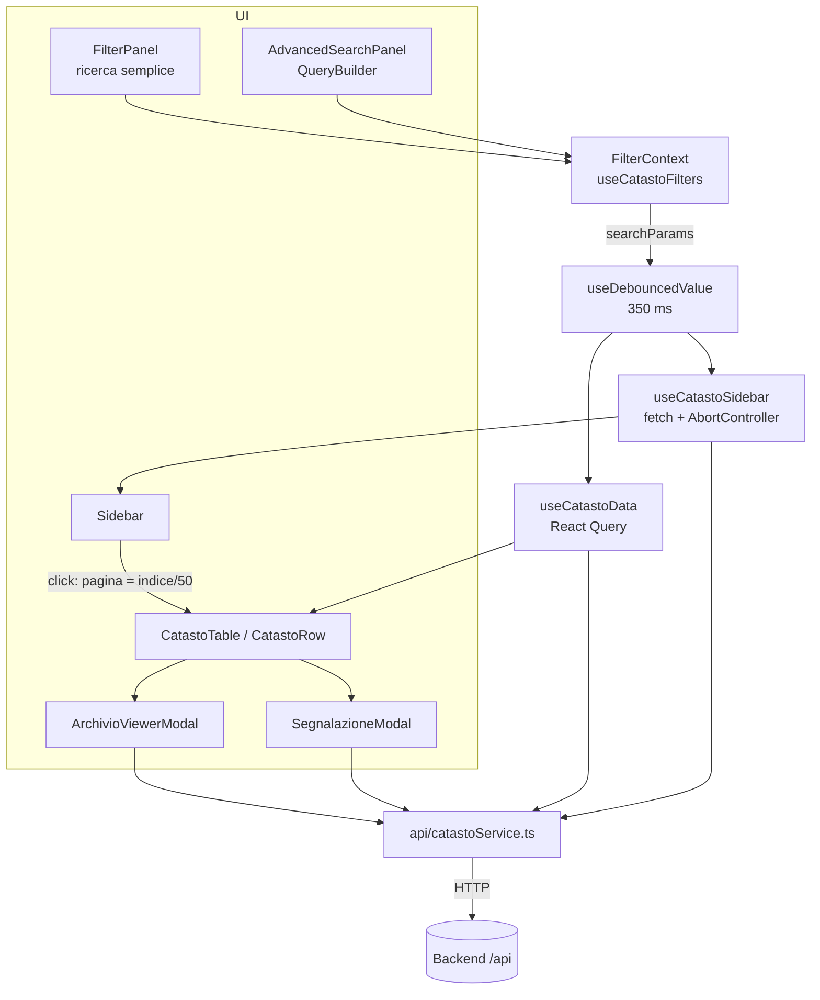
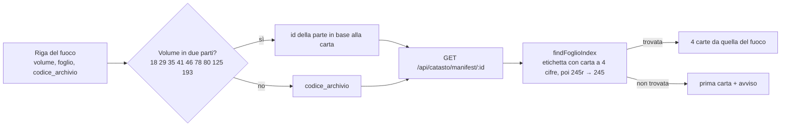

# Frontend — Catasto Fiorentino 1427

Applicazione **React 18 + TypeScript** costruita con **Vite 6**, stile **Tailwind CSS v4**, dati via **TanStack Query 5** e routing con **React Router 7**. Interfaccia interamente in italiano, tema chiaro e scuro, obiettivo di accessibilità WCAG 2.1 AA.

> Vedi anche: [Backend e API](backend.md) · [Architettura](architettura.md) · [Casi d'uso](casi-d-uso.md)

---

## Indice

1. [Pagine](#pagine)
2. [Struttura del codice](#struttura-del-codice)
3. [Stato e flusso dei dati](#stato-e-flusso-dei-dati)
4. [Funzionalità](#funzionalità)
5. [Tema e stile](#tema-e-stile)
6. [Configurazione, build e deploy](#configurazione-build-e-deploy)
7. [Test](#test)
8. [Limiti noti](#limiti-noti)

---

## Pagine

| Percorso | Componente | Contenuto |
|---|---|---|
| `/` | `pages/HomePage.tsx` | Applicazione principale: indice laterale, ricerca semplice/avanzata, tabella dei fuochi, paginazione, visore, segnalazioni |
| `/informazioni` | `pages/InfoPage.tsx` | Descrizione del progetto e crediti (caricata in lazy) |
| `/contatti` | `pages/ContattiPage.tsx` | Indirizzi email e link al repository (lazy) |
| `/mappa` | `pages/MappaPage.tsx` | Segnaposto "in fase di sviluppo", non collegato dal menu (lazy) |

`FilterProvider` avvolge il router: i filtri restano impostati anche passando da una pagina all'altra.

---

## Struttura del codice

```
frontend-catasto/
├── index.html                 # lang="it", carica public/theme-init.js prima del paint
├── public/theme-init.js       # applica il tema salvato (file separato: la CSP vieta script inline)
├── nginx.conf                 # SPA + proxy /api → backend:3005
├── security-headers.conf      # CSP e header di sicurezza
├── vercel.json                # alternativa di deploy statico
└── src/
    ├── main.tsx · App.tsx     # bootstrap, route, lazy loading
    ├── providers/Providers.tsx# QueryClient (retry 1, niente refetch al focus)
    ├── context/FilterContext.tsx
    ├── api/
    │   ├── client.ts          # apiRequest, base URL, messaggi d'errore per l'utente
    │   └── catastoService.ts  # tutte le chiamate al backend
    ├── hooks/
    │   ├── useCatastoFilters.ts   # stato dei filtri, AST, ordinamento, link condivisi
    │   ├── useCatastoData.ts      # tabella paginata + parenti della riga aperta
    │   ├── useCatastoSidebar.ts   # indice a caricamento progressivo
    │   ├── useDebouncedValue.ts · useDarkMode.ts · useMediaQuery.ts · useModal.ts
    ├── components/
    │   ├── layout/            # Header, Footer, Sidebar (lista virtualizzata)
    │   └── common/            # CustomAutocomplete, CustomNumberInput, Spinner
    ├── features/
    │   ├── catasto/
    │   │   ├── components/    # FilterPanel, AdvancedSearchPanel, QueryBuilder,
    │   │   │                  # CatastoTable, CatastoRow, Pagination, ArchivioViewerModal
    │   │   └── lib/           # logica pura, testata
    │   │       ├── simple-filters.ts   # filtri semplici → parametri di query
    │   │       ├── query-ast-utils.ts  # pruneAst: toglie condizioni incomplete
    │   │       ├── query-describe.ts   # AST → frase in italiano
    │   │       ├── query-share.ts      # AST ⇄ link #q=…
    │   │       ├── saved-queries.ts    # query salvate in localStorage
    │   │       ├── archivio.ts         # volumi in due parti, ricerca della carta, URL IIIF
    │   │       └── segnatura.ts        # parser della segnatura (da @catasto/shared)
    │   └── segnalazioni/
    │       ├── components/SegnalazioneModal.tsx
    │       └── api/create-segnalazione.ts
    └── pages/
```

Regole e tipi comuni (campi interrogabili, operatori, limiti dell'AST, parser della segnatura) arrivano da `@catasto/shared`, che Vite importa direttamente dal sorgente (`packages/shared/src`).

---

## Stato e flusso dei dati



- **`useCatastoFilters`** contiene i filtri semplici, l'ordinamento, la modalità avanzata, l'AST in modifica e l'AST "potato" (`queryAst`, senza condizioni incomplete). Produce un unico oggetto `searchParams`.
- **Debounce**: l'intero `searchParams` è ritardato di 350 ms, quindi digitazione, menu e ordinamenti generano una sola richiesta.
- **Modalità esclusive**: in ricerca avanzata l'AST *sostituisce* i filtri semplici (non li combina).
- **Tabella** (`useCatastoData`): chiave React Query `["catastoData", search, page]`, 50 righe per pagina, `keepPreviousData` durante il cambio pagina. Una sola riga aperta alla volta; i parenti si caricano solo quando la riga viene aperta (cache 10 min).
- **Indice** (`useCatastoSidebar`): blocchi da 1000 voci con scroll infinito; ogni nuova ricerca annulla la precedente.
- **URL**: l'unico stato nell'URL è il frammento `#q=` dei link condivisi, letto una volta all'avvio e poi rimosso.

### Chiamate al backend

| Funzione | Endpoint | Quando |
|---|---|---|
| `fetchFuochi(search, "table")` | `GET /api/catasto` o `POST /api/catasto/query` | ricerca semplice / avanzata |
| `fetchFuochi(search, "sidebar")` | `GET /api/catasto/sidebar` o `POST /api/catasto/query` (`view: "sidebar"`) | indice |
| `fetchParenti(id)` | `GET /api/parenti/:id` | apertura di una riga |
| `fetchFilterOptions(geo)` | `GET /api/filters?serie=&quartiere=&piviere=` | avvio e cambio di livello geografico |
| `fetchManifest(id)` | `GET /api/catasto/manifest/:id` | apertura del visore |
| `createSegnalazione(body)` | `POST /api/segnalazioni` | invio di una segnalazione |

`api/client.ts` usa `VITE_API_URL`; se manca, in produzione chiama la stessa origine (`/api`, proxato da nginx), in sviluppo `http://localhost:3005`. Gli errori 4xx mostrano il messaggio del backend, gli altri un testo generico in italiano.

---

## Funzionalità

### Ricerca semplice (`FilterPanel`)

- Sempre visibili: **Cerca Persona**, **Cerca Località**, **Volume**, pulsante **Aggiorna**.
- Pannello **Altri filtri** (con contatore dei filtri attivi):
  - attributi a scelta con autocompletamento: Mestiere, Rapporto, Bestiame, Immigrazione, Particolarità parente, Casa;
  - geografia a cascata **Serie → Quartiere → Piviere → Popolo** (cambiare un livello azzera quelli sotto e restringe le opzioni);
  - intervalli min/max in fiorini: Fortune, Credito, Credito ai Monti, Imponibile, Deduzioni.
- **Azzera filtri** ripristina filtri, ordinamento e AST.
- `CustomAutocomplete` è un combobox ARIA completo (frecce, Home/End, Invio, Esc, Canc), mostra al massimo 100 voci per volta.

### Ricerca avanzata (`AdvancedSearchPanel`, `QueryBuilder`)

- Gruppi **Tutte** (AND) / **Almeno una** (OR), con **Escludi** (NOT) e annidamento fino a 5 livelli.
- Ogni condizione: campo → operatore compatibile col tipo → valore (testo, numero, intervallo, scelta singola o multipla).
- **Anteprima** in linguaggio naturale, ad esempio: *Mostra i fuochi dove Mestiere è uguale a "Lanaiolo" e (Fortune maggiore di 1000 oppure Casa è uguale a "Propria")*.
- **Filtri salvati**: in `localStorage` (`catasto.savedQueries.v1`, max 50, nome max 60 caratteri); stesso nome = sovrascrittura. Restano sul dispositivo.
- **Condividi link**: copia `https://…/#q=<base64url del JSON dell'AST>` (max 2000 caratteri). Il frammento `#` non arriva ai log dei server. Chi apre il link entra direttamente in ricerca avanzata.

### Indice laterale (`Sidebar`)

Elenco virtualizzato (nome + mestiere) dei fuochi della ricerca corrente. Cliccando una voce la tabella passa alla pagina corrispondente (`indice / 50 + 1`). Aperto di default su desktop, a sovrapposizione su mobile.

### Tabella e scheda del fuoco (`CatastoTable`, `CatastoRow`)

- Desktop (≥ 1024 px): tabella con colonne **Capofamiglia**, **Località**, **Dati sintetici**, **Riferimenti**, ordinabili (tranne Riferimenti) con `aria-sort`. Mobile: schede.
- **Riferimenti**:
  - **Campione** "Vol. X c. Y": apre il visore se il volume è digitalizzato;
  - **Portata**: compare quando la redazione ha pubblicato la segnatura; apre il visore se anche quel volume è digitalizzato.
- **Riga aperta**:
  - *Dettagli economici*: credito, credito ai monti, fortune, deduzioni, imponibile in fiorini; bestiame, immigrazione, rapporto di mestiere, particolarità;
  - *Composizione familiare*: parentela, sesso, età, stato civile, particolarità di ogni membro;
  - azioni **Segnala un errore** e, se manca la portata, **contribuisci** con la segnatura.

### Visore delle carte (`ArchivioViewerModal`)



- Immagini IIIF a 1600 px, a piena risoluzione sopra il 120% di zoom; le carte vicine sono precaricate.
- Zoom 20–500% (rotella, pulsanti, tasti `+`/`-`), trascinamento, pinch e swipe su touch, frecce per cambiare carta, **Adatta** per ripristinare.
- Link al **sito originale** dell'Archivio digitale e pulsante **Segnala segnatura**.
- `useModal` gestisce Esc, focus trap, ripristino del focus, blocco dello scroll e modali sovrapposte.

### Segnalazioni (`SegnalazioneModal`)

| Tipo | Campi | Note |
|---|---|---|
| **Dato errato** | campo errato (obbligatorio), valore corretto | il valore attuale viene allegato automaticamente |
| **Segnatura della portata** | segnatura (obbligatoria) | prefisso implicito `ASFi, Catasto`; casella "altro fondo" per toglierlo |
| **Altro** | valore proposto o note | |
| *tutti* | note (max 2000), email facoltativa | campo nascosto `website` come honeypot |

Dopo l'invio compare la conferma "verificata dalla redazione": nulla viene pubblicato senza moderazione.

---

## Tema e stile

- Token di colore definiti in `src/index.css` (`:root` e `.dark`) ed esposti a Tailwind v4 con `@theme`; variante `dark` basata sulla classe `.dark` su `<html>`.
- `useDarkMode` legge `localStorage.theme`, altrimenti `prefers-color-scheme`; `public/theme-init.js` applica la classe prima del primo paint per evitare lampeggi.
- Carattere: **Source Serif 4** per tutta l'interfaccia.
- `prefers-reduced-motion` è rispettato globalmente.

---

## Configurazione, build e deploy

| Comando (in `frontend-catasto/`) | Effetto |
|---|---|
| `npm run dev` | server Vite su `http://localhost:5173` |
| `npm run build` | bundle in `dist/` |
| `npm run preview` | serve la build |
| `npm run lint` | ESLint, zero warning ammessi |
| `npm test` | Vitest (ambiente node) |

**Variabili**: solo `VITE_API_URL` (facoltativa, letta a build time).

**nginx** (immagine Docker): SPA fallback su `index.html`, `/assets/` con cache immutabile di un anno, `/api` proxato a `http://backend:3005` con `X-Forwarded-For` impostato all'IP del client, gzip, body max 128 kB.

**Header di sicurezza** (`security-headers.conf`): CSP `default-src 'self'; script-src 'self'; img-src 'self' data: https:; connect-src 'self'; frame-ancestors 'none'…`, `X-Frame-Options: DENY`, `nosniff`, `Referrer-Policy`, `Permissions-Policy`, COOP. HSTS va configurato sul terminatore TLS.

**Vercel** (`vercel.json`): stesse intestazioni con `connect-src 'self' https:`; non c'è proxy per `/api`, quindi va impostato `VITE_API_URL` verso il backend.

---

## Test

Test unitari sulla logica pura in `features/catasto/lib/`:

- `archivio.test.ts`: scelta della parte del volume, ricerca della carta, URL IIIF;
- `segnatura.test.ts`: parsing delle segnature della portata;
- `simple-filters.test.ts`: conversione dei filtri in parametri.

Non ci sono ancora test di componenti o hook (niente jsdom).

---

## Limiti noti

Dalla revisione di settembre 2026 (dettagli e priorità in [revisione-codice.md](revisione-codice.md)):

- Dopo il primo caricamento, filtri e cambi pagina non mostrano indicatori di attesa (skeleton, `aria-busy`, pulsanti disabilitati).
- Cliccando nell'indice un fuoco che sta in un'altra pagina, la tabella cambia pagina ma non apre né evidenzia la riga.
- Ricerca avanzata su Serie/Quartiere/Piviere/Popolo: le opzioni che uniscono partizioni omonime restituiscono solo la prima.
- Nel visore su mobile i gesti touch smettono di funzionare riaprendo lo stesso volume.
- Un link `#q=` malformato o una query salvata corrotta bloccano l'app (manca un error boundary).
- "Salva filtro" non funziona se il sito è servito in HTTP semplice (`crypto.randomUUID` richiede un contesto sicuro).
