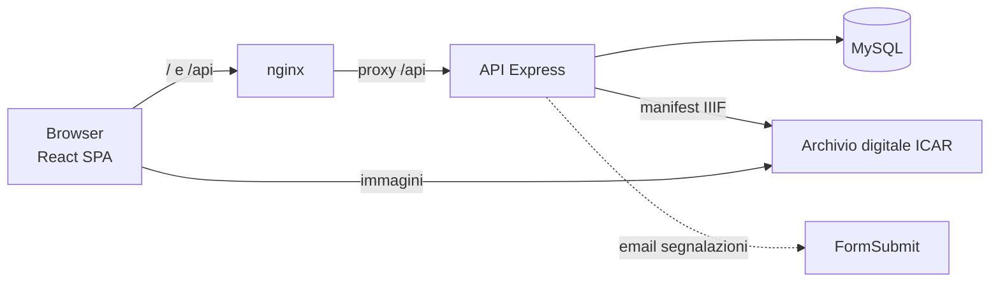

<div align="center">
  <h1>📜 Catasto Fiorentino 1427</h1>
  <h3>Archivio digitale e sistema di esplorazione</h3>
  <p>Un portale per consultare, interrogare e verificare sulla fonte i dati del catasto della Repubblica di Firenze del 1427/30.</p>

  <div style="display: flex; justify-content: center; gap: 10px; margin-top: 20px; margin-bottom: 20px;">
    
    
    
    
    
    
  </div>

  
</div>

---

## Panoramica

**Catasto Fiorentino 1427** rende consultabile e ricercabile il censimento fiscale della Firenze del XV secolo. Per ogni **fuoco** (nucleo familiare) il portale mostra i dati economici, la composizione familiare e la località, e porta alla **carta originale** digitalizzata dall'Archivio di Stato di Firenze.

I dati provengono dalla ricerca di Klapisch-Zuber, digitalizzata da [ACRH](https://journals.openedition.org/acrh/7458) (circa 61.000 fuochi e 270.000 parenti). Le immagini arrivano dal servizio IIIF dell'Archivio digitale ICAR / ASFi.

Il portale è pensato per:

- **studiosi e ricercatori**, che costruiscono query precise e verificano il dato sulla fonte;
- **studenti**, che esplorano il catasto senza una formazione archivistica;
- **la redazione**, che modera le segnalazioni degli utenti e pubblica le segnature verificate.

## Funzionalità

| | Funzionalità | Descrizione |
|---|---|---|
| 🔎 | **Ricerca semplice** | Per persona ("Nuto di Nardo"), località e volume; filtri su mestiere, bestiame, immigrazione, casa e particolarità; geografia a cascata Serie → Quartiere → Piviere → Popolo; intervalli in fiorini su fortune, credito, credito ai monti, imponibile e deduzioni |
| 🧩 | **Ricerca avanzata** | Query composte con gruppi AND/OR, esclusione e annidamento, anteprima in italiano, 20 campi interrogabili, compresi età e particolarità dei parenti |
| 🔗 | **Query salvate e condivise** | Salvataggio sul dispositivo e link condivisibili (`#q=…`) che riaprono la stessa ricerca |
| 👪 | **Scheda del fuoco** | Dati economici, mestiere, località e composizione familiare (parentela, età, stato civile) |
| 🖼️ | **Visore delle carte** | Apre il volume IIIF sulla carta del fuoco (campione e, quando nota, portata), con zoom, trascinamento e gesti touch |
| ✍️ | **Segnalazioni** | Dato errato, segnatura della portata o altro, con moderazione della redazione tramite link firmati via email o API |
| 🌓 | **Tema chiaro e scuro** | Con obiettivo di accessibilità WCAG 2.1 AA |

## Architettura in breve



È un monorepo con npm workspaces:

| Workspace | Contenuto |
|---|---|
| [`frontend-catasto/`](frontend-catasto) | React 18, Vite 6, Tailwind v4, TanStack Query, React Router 7 |
| [`backend-catasto/`](backend-catasto) | Node 20, Express 4, mysql2, zod, helmet, rate limiting |
| [`packages/shared/`](packages/shared) | `@catasto/shared`: tipi, registro dei campi interrogabili, limiti delle query, parser delle segnature |

## Avvio rapido

Servono **Node.js ≥ 20** e **MySQL 8**. Il dump `Catasto.sql` non è nel repository e va richiesto ai gestori del progetto.

```bash
git clone https://github.com/AntonioOrf/Catasto.git && cd Catasto
npm install
mysql -u root -p -e "CREATE DATABASE catasto CHARACTER SET utf8mb4"
mysql -u root -p catasto < init/Catasto.sql            # dump dei dati
# crea backend-catasto/.env con DB_HOST, DB_USER, DB_PASSWORD, DB_NAME (vedi la guida)
npm run db:migrate -w catasto-backend                  # tabelle applicative
npm run dev                                            # frontend :5173, API :3005
```

Per la produzione con Docker (porta `1427`) segui la [guida all'installazione](docs/guides.md).

## Documentazione

| Documento | Contenuto |
|---|---|
| [Installazione e deployment](docs/guides.md) | Sviluppo locale, Docker Compose, migrazioni, aggiornamenti, risoluzione dei problemi |
| [Architettura e modello dati](docs/architettura.md) | Componenti, diagramma ER, glossario, pipeline di deploy, sicurezza |
| [Backend e API](docs/backend.md) | Endpoint con esempi, formato delle query avanzate, segnalazioni e moderazione, variabili d'ambiente |
| [Frontend](docs/frontend.md) | Pagine, componenti, flusso dei dati, visore, segnalazioni, build |
| [Casi d'uso](docs/casi-d-uso.md) | Otto scenari reali con diagrammi di sequenza, di stato e di flusso |
| [Revisione del codice](docs/revisione-codice.md) | Problemi noti con priorità, stato dei test |
| [Product brief](frontend-catasto/PRODUCT.md) | Utenti, principi e vincoli del prodotto |

## Contribuire

1. Crea un ramo dal `main`.
2. Prima di aprire la PR esegui i controlli della CI: `npm run build`, `npm run lint -w catasto-frontend`, `npx tsc --noEmit` in `backend-catasto/` e `frontend-catasto/`, `npm test`.
3. Se aggiungi tabelle, crea una nuova migrazione numerata in `backend-catasto/migrations/`.
4. Se aggiungi un campo interrogabile, basta dichiararlo in `packages/shared/src/fields.ts`: frontend e backend lo usano entrambi.

A ogni merge su `main` la CI pubblica automaticamente le immagini Docker.

## Autori e licenza

Progetto di **Antonio Orfitelli** e **Pasquale Ruotolo**. Codice rilasciato con [licenza MIT](LICENSE). I dati del catasto e le immagini d'archivio restano soggetti ai termini delle rispettive fonti.
